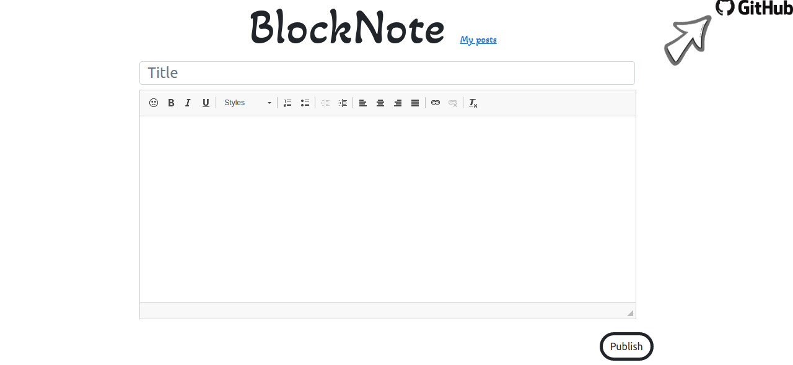
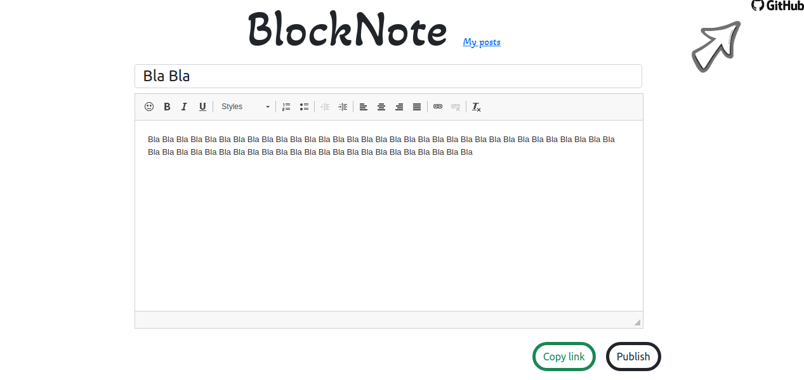

[![Forks][forks-shield]][forks-url]
[![Stargazers][stars-shield]][stars-url]
[![Issues][issues-shield]][issues-url]
<a href="http://www.djangoproject.com/"></a>


<!-- PROJECT LOGO -->
<br />
<p align="center">
  <a href="https://github.com/mirsaid-mirzohidov/blocknote/">
    
  </a>

  <h1 align="center">BlockNote</h1>

  <p align="center">
    BlockNote note app on Django
    <br />
    <a href="https://github.com/mirsaid-mirzohidov/blocknote/issues">Report Bug</a>
    ·
    <a href="https://github.com/mirsaid-mirzohidov/blocknote/issues">Request Feature</a>
    ·
    <a href="https://github.com/mirsaid-mirzohidov/blocknote/pulls">Send a Pull Request</a>
  </p>
</p>


### Current features

* Login and Registration

* Ckeditor for editing texts

* The article can only be changed by the author

* Todo app


### Todo [BlockNote Project](https://github.com/mirsaid-mirzohidov/blocknote/projects/1)
* [ ] Translate views functions at main app into classes


### Development requires

* [Python 3.8.0](https://www.python.org/downloads/release/python-380/)
* [Django 3](https://www.djangoproject.com/) 
* [Editor.js](https://pypi.org/project/django-editorjs-fields/)  


### Installation
```sh
# make sure that the virtual environment with python 3.8 is activated

git clone https://gitlab.com/mirsaid-mirzohidov/blocknote.git # copy the project locally
pip install -r requirements.txt  # installing python dependencies
python manage.py migrate # database migration (preparation) 

```

### Launch
```sh
python manage.py runserver
```


# Screenshots

### Main page



### Artcile list page


### Edit page




<!-- MARKDOWN LINKS & IMAGES -->
<!-- https://www.markdownguide.org/basic-syntax/#reference-style-links -->
[forks-shield]: https://img.shields.io/github/forks/mirsaid-mirzohidov/blocknote?style=for-the-badge
[forks-url]: https://github.com/mirsaid-mirzohidov/blocknote/network/members
[stars-shield]: https://img.shields.io/github/stars/mirsaid-mirzohidov/blocknote?style=for-the-badge
[stars-url]: https://github.com/mirsaid-mirzohidov/blocknote/stargazers
[issues-shield]: https://img.shields.io/github/issues/mirsaid-mirzohidov/blocknote?style=for-the-badge
[issues-url]: https://github.com/mirsaid-mirzohidov/blocknote/issues
